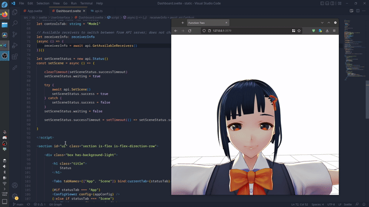

# Function Two
A project comprised of one, possibly two, *maybe even three* functions to make VTubing easy.
While existing VTube software for 3D avatars are available, none are as truly cross-platform as this one.

## Cool GIF showing what it can do


## For users
Go to the [releases](https://github.com/thatpix3l/fntwo/releases) page and find the appropriate download link for your platform

## For developers
To manually build, here are the prequisistes:
- git
- go
- npm

After the above are installed, run the following:
```sh
git clone --recurse-submodules https://github.com/thatpix3l/fntwo.git
cd fntwo
go generate ./... && go build -o build
```
The final binary for your platform resides in the project root's `build` folder

## How to use
Start the program in a terminal window; open both your desktop browser and the OBS browser source to `127.0.0.1:3579`.
In the desktop browser, pressing ESCAPE opens the main menu.
In the main menu, dragging and dropping a `.vrm` file onto the left pane loads the new model.
Controls are as follows:
- Left-click and drag **rotates the camera**
- Right-click and drag **pans the camera** up & down, left & right.
- W, A, S, D **pans the camera** forward & backward, left & right.